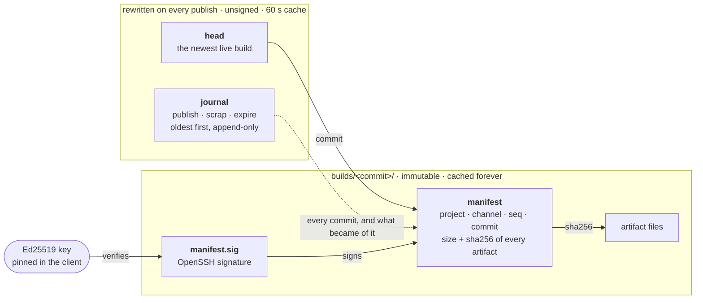
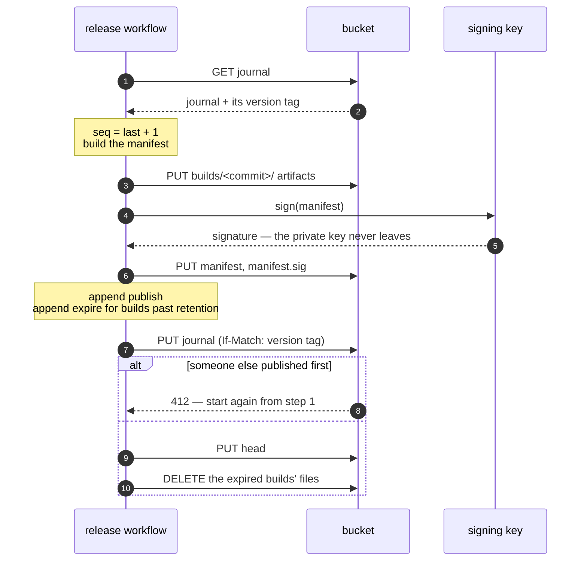
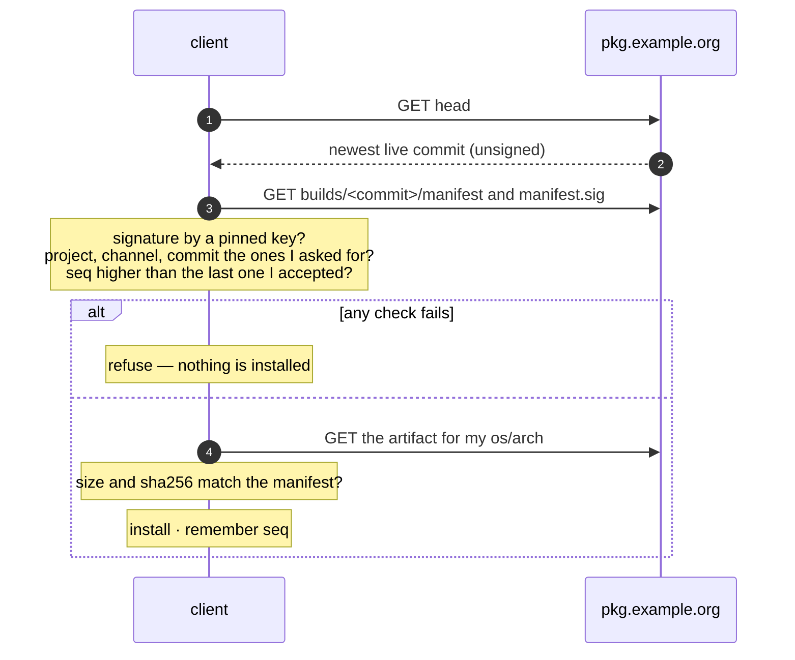
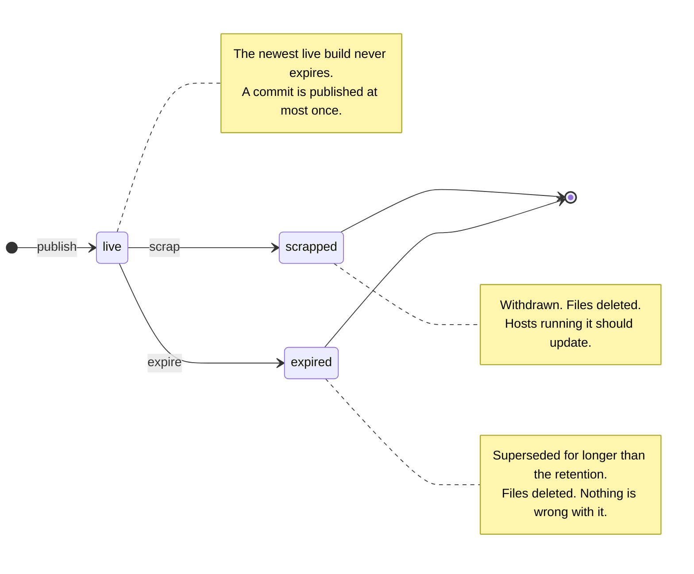

# engram

*The trace a memory leaves.* Release channels as an append-only journal: what a
project published, what it took back, and one signed manifest per build —
in a text format you can read with `grep` and verify with `ssh-keygen`.

```
engram version=1 kind=journal
channel project=acme name=dev
publish seq=1 commit=1f3e9aa0… version=26.09.20-dev.1f3e9aa time=2026-09-20T18:02:11Z min_enboot=1
scrap seq=2 commit=1f3e9aa0… time=2026-09-21T08:50:12Z reason=broken
publish seq=3 commit=a7072af3… version=26.09.21-dev.a7072af time=2026-09-21T09:10:55Z min_enboot=1
```

[`SPEC.md`](SPEC.md) is the contract. This repository holds three things built
on it:

| | |
| --- | --- |
| **the library** — `github.com/neuroplastio/engram` | what a client imports to follow a channel and believe only what a pinned key signed. |
| **the publisher** — `cmd/engram` | what a release workflow calls: upload to any S3-compatible bucket, sign, record. |
| **enboot** — [`github.com/neuroplastio/engram/enboot`](enboot/) | what a program embeds to replace itself without losing what it is running. Its own module. |

**Neither module has any dependencies** — both `go.mod` files require nothing.
S3 and KMS are a handful of HTTPS requests signed by [`sigv4/`](sigv4/), not an
SDK.

engram releases itself, with itself: every push to `main` is a build on
`pkg.neuroplast.io/engram/dev`, published by the binary built from that commit.

## How it works

### What a channel is

Two files move and only point. One file per build never changes, and is the
only thing that is signed.



### Publishing

Everything a client could be pointed at exists before anything points at it,
and the journal is written conditionally, so two publishers cannot overwrite
each other.



### Updating

The head says where to look. The manifest says whether to believe it.



"A build of *my* commit" skips the first step: `GET builds/<commit>/manifest`
directly, and a 404 means *not live on this channel*.

### The life of a build



## Why it looks like this

- **No JSON, no quotes.** The grammar is a split on spaces and a split on `=`,
  because one of its readers is meant to be a binary that is almost never
  updated.
- **A journal, not a list.** A list of live builds cannot tell you whether your
  build was withdrawn or is merely old. A journal can, and says when and why.
- **Builds are addressed by commit.** "A build of *my* commit" is one request
  and no index. A replaced release is a new path, so nothing is ever
  invalidated in a cache.
- **Only the manifest is signed**, once, when it is built. The files that move
  just point; what they point at says whether to believe them.
- **OpenSSH signatures.** The verifier is a few length-prefixed fields around
  one Ed25519 check, and the tool to check a release by hand is already on
  every Mac and Linux machine.

## Following a channel

```go
c := &engram.Client{Base: "https://pkg.example.org", Project: "acme", Channel: "dev", Keys: pinned}

m, err := c.Latest(ctx, accepted) // nil, nil: nothing newer
a, _ := m.Find("acme", runtime.GOOS, runtime.GOARCH)
data, err := c.Download(ctx, m, a) // size and sha256 checked

m, err = c.Manifest(ctx, myCommit) // "a build of my commit"; engram.ErrNotLive if there is none
```

## Publishing

```sh
engram publish --bucket my-releases --kms alias/release-signing \
  --project acme --channel dev --retention 720h \
  --commit "$(git rev-parse HEAD)" --version "$VERSION" \
  --time "$(git show -s --format=%cI HEAD)" \
  acme/linux/amd64=dist/acme_linux_amd64.tar.gz \
  acme/darwin/arm64=dist/acme_darwin_arm64.tar.gz

engram scrap  --bucket my-releases --project acme --channel dev --commit <40 hex> --reason broken
engram pubkey --kms alias/release-signing --identity release@example.org   # an allowed_signers line
engram verify --url https://pkg.example.org --project acme --channel dev --signers allowed_signers --fetch
```

- **Where.** `--bucket` is a bucket of any S3-compatible service; `--endpoint`
  names one that is not AWS (R2, MinIO, …). `--dir` publishes into a directory
  instead, for a dry run. The service must honour conditional writes
  (`If-Match`, `If-None-Match`): that is what makes two concurrent publishers
  safe.
- **The cache.** `--cloudfront <distribution>` names a CloudFront distribution
  in front of the bucket. Builds are served as immutable, so a cache goes on
  serving one after its files are deleted; with this, `scrap` and an expiry
  purge `builds/<commit>/` as well. Without it, withdrawing a build takes
  effect only where nobody had fetched it yet.
- **The key.** `--kms` signs with an Ed25519 key in AWS KMS, which cannot be
  exported — there is no secret to store. `--key-file` signs with an
  unencrypted OpenSSH key instead, for anyone without a KMS.
- **Credentials** are the standard environment variables, and only those:
  `AWS_ACCESS_KEY_ID`, `AWS_SECRET_ACCESS_KEY`, `AWS_SESSION_TOKEN`. In CI,
  `aws-actions/configure-aws-credentials` exports them from an OIDC role. On a
  workstation: `eval "$(aws configure export-credentials --format env)"`.

Re-running `publish` for a commit that is already in the journal succeeds
without doing anything, so a release workflow can be retried.

## Installing from a channel

[`install.sh`](install.sh) installs a binary from a channel with `curl`,
`ssh-keygen`, `sha256sum` and `tar` — you do not need engram to check engram.
The key is pinned by the caller, never fetched:

```yaml
- name: Install engram
  env:
    ENGRAM_SIGNERS: release@neuroplast.io namespaces="engram" ssh-ed25519 AAAA…
  run: curl -fsS https://pkg.neuroplast.io/engram/install.sh | sh -s -- engram ./bin
```

## Checking a release by hand

```sh
curl -sO https://pkg.example.org/acme/dev/builds/<commit>/manifest
curl -sO https://pkg.example.org/acme/dev/builds/<commit>/manifest.sig
ssh-keygen -Y verify -f allowed_signers -I release@example.org -n engram \
  -s manifest.sig < manifest
sha256sum acme_linux_amd64.tar.gz   # compare with the manifest's artifact line
```

## Development

```
make check    # gofmt, vet, tests — ssh-keygen is the oracle for signatures, and
              # enboot is tested by a tenant that really replaces itself
make build    # bin/engram, bin/enboot
make dist     # reproducible release tarballs for every platform
```
