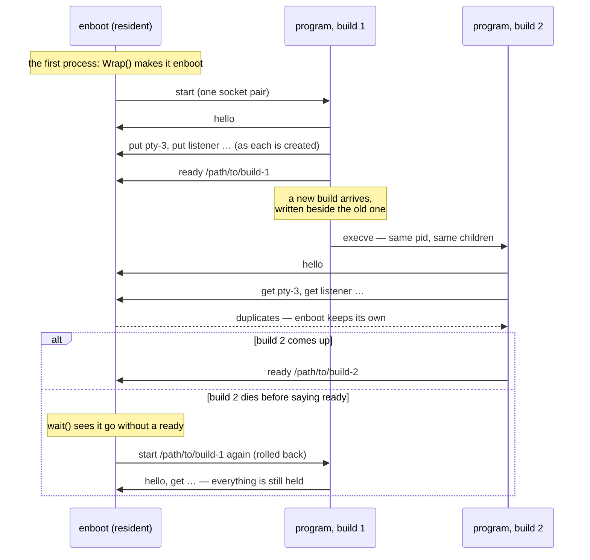

# enboot

Lets a program replace itself without losing what it is running.

```go
import "github.com/neuroplastio/engram/enboot"

func main() {
	b := enboot.Wrap() // the first process becomes enboot and never returns
	b.Hello()

	b.Put("pty-3", fd)    // when a descriptor is created, not at update time
	b.Ready(self)         // "I am up": this path is now the rollback target

	// … later, to update: write the new binary beside the old one, then
	b.Exec(newPath, os.Args)
}
```

One process stays resident — the *enboot* — and holds duplicates of whatever
descriptors the program deposits with it: pty masters, listening sockets,
socket pairs to children. The program — the *tenant* — updates by replacing its
own image with `execve`, which keeps its pid and its children, and asks for its
descriptors back. If the new image dies before it says `ready`, enboot
starts the last good one again, still holding everything.



**A program embeds both halves.** `Wrap` makes the first process the
enboot of a second copy of the same executable, so there is no other binary to ship,
install or keep in step. The resident process keeps running the code it was
started with, however many times the tenant replaces itself.

It is its own module, with no dependencies, so that embedding it costs a
program nothing else:

```
go get github.com/neuroplastio/engram/enboot
```

[`PROTOCOL.md`](PROTOCOL.md) is the whole protocol: eight verbs over one socket
pair, in a page. For a program that is not written in Go,
`cmd/enboot` is the resident half as a command —
`enboot <program> [args...]` — and the tenant's half is that page.

## What the resident half must stay

It is meant to change almost never: a program can only update itself freely if
the thing underneath it does not need updating too. So it has **no download, no
verification and no version policy** — it is handed a path, it does not choose
one. Following a release channel and verifying a build is the tenant's job,
with the engram library. `PROTOCOL.md` ends with the complete list of reasons
the resident half could ever need to change; a change that is not on that list
belongs in the tenant.

A release's manifest carries `min_enboot`: the lowest protocol version a
build can be handed to. `Hello` returns the version the resident process
speaks. When a build needs a newer one, that update — and only that one — needs
the whole program restarted.

## What a tenant must do

- **Deposit early.** `Put` a descriptor when it is created. A tenant that
  crashes has then lost nothing either.
- **`Hello` first, `Ready` when it is true.** `Ready` is what a rollback
  returns to; say it only once the image has everything it needs.
- **Keep the old binary.** A rollback starts the last path that said `Ready`.
  If an update overwrote that file, there is nothing to go back to.
- **Stop reading before `Exec`.** Descriptors cross the gap with their kernel
  buffers intact; a reader that is still running in the old image can take
  bytes the new one never sees.

Children never see the connection: `Dial` marks the descriptor close-on-exec
and removes its variables from the environment, and `Exec` puts them back for
that one exec.

## Platform notes

- **macOS:** write a new binary beside the old one and rename; overwriting a
  signed binary in place gets the next launch killed.
- **macOS:** a child that exits with unread output waits for it to drain for as
  long as *any* copy of its pty master is open — including enboot's. It
  cannot happen while a tenant is reading, and enboot exits when its
  tenant does, so it must not be given a reason to outlive one.
- **Linux:** enboot is a sub-reaper; children orphaned by a tenant that
  exits rather than `execve`s become its children, and `Reaped` reports them.

## What was measured

The mechanism was measured on Linux and macOS before it was written down: no
measurable cost for a process that only *holds* a duplicate descriptor
(proxying the bytes through it, by contrast, costs a fifth of the throughput),
nothing lost across the gap when the old image stops reading first, and a
rollback in milliseconds with the children alive. Listening sockets and socket
pairs cross the same way ptys do; a client that connects during the gap waits
in the backlog and is answered by the new image.

Nothing in it knows what the program is. The protocol's vocabulary is *enboot,
tenant, name, descriptor, path, pid, status*, and no other noun.
